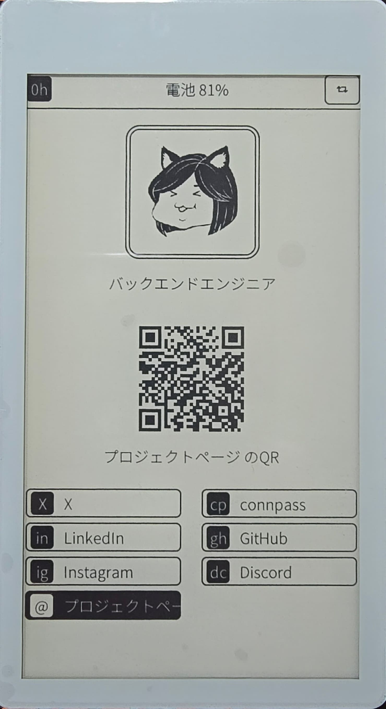
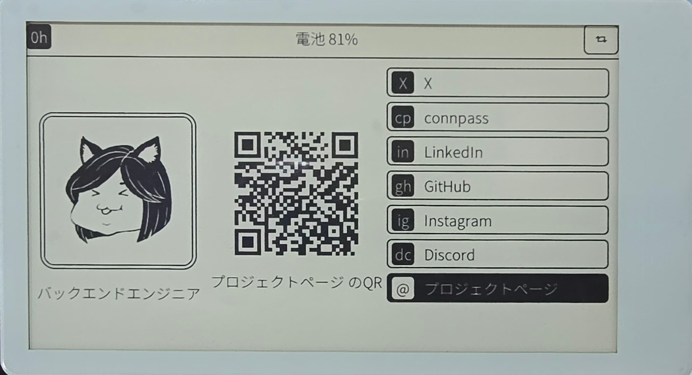

# E-Ink Business Card

Digital business card firmware for the LilyGO T5 4.7" S3 e-paper board. Displays an avatar, a QR code, and a touch-selectable link list. Battery powered, sleeps on inactivity, wakes on touch, and can be switched off entirely with a button.

ESP-IDF 4.4.x · LVGL 9.5 · C++17

<p align="center">
  
  &nbsp; &nbsp; &nbsp;
  
</p>

---

## 1. Hardware

| Item          | Value                                         |
| ------------- | --------------------------------------------- |
| Board         | LILYGO T5-4.7-S3, rev V2.4 (capacitive touch) |
| MCU           | ESP32-S3-WROOM-1-N16R8                        |
| Flash / PSRAM | 16 MB / 8 MB octal                            |
| Panel         | ED047TC1, 960×540, 16 grayscale levels        |
| Touch         | GT911, 2-point, I2C 0x5D                      |
| RTC           | PCF8563, I2C 0x51 (CLKOUT disabled, see 3.4)  |
| Battery       | Li-Po, JST-PH 2.0                             |

### 1.1 Pin map

Used by this firmware:

| Pin  | Function                                 | Defined in          |
| ---- | ---------------------------------------- | ------------------- |
| IO17 | I2C SCL                                  | `I2C_MASTER_SCL_IO` |
| IO18 | I2C SDA                                  | `I2C_MASTER_SDA_IO` |
| IO47 | GT911 INT — address latch and sleep hold | `TOUCH_INT_PIN`     |
| IO14 | Battery ADC, 1:2 divider, ADC2_CH3       | `BATTERY_ADC_GPIO`  |
| IO21 | Sleep button                             | `SLEEP_BUTTON_PIN`  |

IO21 rather than IO00 for the button: IO00 is a strapping pin, and holding it low across a reset can drop the chip into download mode. Deep sleep wakeup goes through a reset, so that risk is real. IO21 also sits inside the RTC domain (GPIO0–21), a hard requirement for EXT1 wakeup.

Occupied by the board, not available:

| Pins                   | Function                        |
| ---------------------- | ------------------------------- |
| IO00–IO07              | Panel data bus D0–D7            |
| IO45, IO48             | Panel STV / LE                  |
| IO11, IO15, IO16, IO42 | TF card SCLK / MOSI / MISO / CS |
| IO09                   | PCF8563 interrupt               |
| IO00, RST              | BOOT and reset buttons          |
| IO19, IO20             | USB D-/D+                       |

ADC2 channel mapping on ESP32-S3, for relocating the battery sense pin:

```
GPIO11=CH0  GPIO12=CH1  GPIO13=CH2  GPIO14=CH3
GPIO15=CH4  GPIO16=CH5  GPIO17=CH6  GPIO18=CH7
```

`BATTERY_ADC_GPIO` and `BATTERY_ADC_CHANNEL` must be changed together.

---

## 2. Build

Requires **ESP-IDF 4.4.x**. Does not build on 5.x: the ADC API changed and the panel driver is unported.

```bash
git clone https://github.com/0hJonny/epd-lilygo-badge.git
cd epd-lilygo-badge

# 1. Panel driver - not included, see 2.3
#    this is a required step; the build fails without it

# 2. Build
. $IDF_PATH/export.sh
idf.py set-target esp32s3
idf.py build
idf.py -p /dev/ttyACM0 flash monitor
```

Run `idf.py fullclean` after changing the source file list or any embedded filename; CMake caches both.

### 2.1 Configuration

`sdkconfig` is generated and gitignored. Tracked settings live in `sdkconfig.defaults`. The build never overwrites values already present in `sdkconfig`, so delete it before rebuilding to pick up changed defaults.

Settings that will break the build or the firmware if changed:

| Option                                                    | Value | Consequence if absent                                          |
| --------------------------------------------------------- | ----- | -------------------------------------------------------------- |
| `CONFIG_ESP32S3_SPIRAM_SUPPORT`, `CONFIG_SPIRAM_MODE_OCT` | `y`   | Frame buffers total ~1.3 MB; first allocation aborts           |
| `CONFIG_ESPTOOLPY_FLASHSIZE_16MB`                         | `y`   | Flash size mismatch                                            |
| `CONFIG_PARTITION_TABLE_CUSTOM`                           | `y`   | Firmware exceeds the default app partition                     |
| `CONFIG_LV_FONT_MONTSERRAT_14`                            | `y`   | `LV_SYMBOL_LOOP` has no glyph; the rotate button renders blank |
| `CONFIG_LV_DRAW_SW_SUPPORT_L8`                            | `y`   | The render format set in `initLvgl()` is unsupported           |

CPU runs at **80 MHz** (`CONFIG_ESP32S3_DEFAULT_CPU_FREQ_80`). Note the `ESP32S3_` prefix — the generic `ESP_DEFAULT_CPU_FREQ_MHZ_*` symbol does not exist for this target in 4.4. Software rendering is correspondingly slow; see the note on circular masks in 3.1.

### 2.2 Partition table

`partitions.csv` in the project root, referenced by `CONFIG_PARTITION_TABLE_CUSTOM_FILENAME`.

| Name       | Type | Size  |
| ---------- | ---- | ----- |
| `nvs`      | data | 16 KB |
| `otadata`  | data | 8 KB  |
| `phy_init` | data | 4 KB  |
| `factory`  | app  | 4 MB  |

About 12 MB of the 16 MB flash is unallocated. `otadata` is vestigial — there are no OTA app partitions.

### 2.3 Panel driver

**Required, and not included in this repository.**

| Item     | Value                                                                            |
| -------- | -------------------------------------------------------------------------------- |
| Upstream | [LilyGo-EPD47](https://github.com/Xinyuan-LilyGO/LilyGo-EPD47), `esp32s3` branch |
| License  | GPL-3.0                                                                          |

The panel driver is kept separate to maintain this repository's MIT license. You will need to download it manually before building:

```bash
git clone -b esp32s3 https://github.com/Xinyuan-LilyGO/LilyGo-EPD47.git /tmp/epd47

# Locate the component - the upstream layout has changed between
# releases, so find it rather than assuming a path
find /tmp/epd47 -name epd_driver.h

# Copy that directory
mkdir -p components
cp -r /tmp/epd47/<that-directory> components/epd_driver
```

The directory must end up containing `epd_driver.h` and a `CMakeLists.txt` reading:

```cmake
idf_component_register(SRC_DIRS "."
                       INCLUDE_DIRS "."
                       PRIV_REQUIRES esp_lcd)
```

### 2.4 Font

`main/ui_font_jp.otf` is committed, so the project builds as-is.

Rebuild it only when changing displayed text (see `fonts/README.md` for details):

```bash
cd fonts && python3 build_font.py NotoSansJP-Light.ttf
```

The source font is included in `fonts/` so no external download is needed. It is an unmodified version of Noto Sans JP Light from Google Fonts, redistributed under the [SIL OFL 1.1](fonts/OFL.txt).

### 2.5 C++17

`socials.h` uses `inline constexpr`. If the toolchain rejects inline variables, add to the root `CMakeLists.txt` after `project()`:

```cmake
idf_build_set_property(CXX_COMPILE_OPTIONS "-std=gnu++17" APPEND)
```

---

## 3. Configuration files

Four headers hold everything intended to be edited. No other file needs changing for normal customisation.

### 3.1 `main/user_profile.h` — owner content

| Symbol                          | Type          | Notes                                                     |
| ------------------------------- | ------------- | --------------------------------------------------------- |
| `UserProfile::PHOTO_SIGN`       | `const char*` | Avatar caption on the main screen                         |
| `UserProfile::STATUS_BADGE`     | `const char*` | Status bar chip, 40×40 px. 1–2 characters                 |
| `UserProfile::SLEEP_SIGN`       | `const char*` | Caption on the sleep screen, under the QR code            |
| `UserProfile::SLEEP_LINK_INDEX` | `int`         | Which `SOCIAL_LINKS` entry the sleep screen encodes       |
| `UserProfile::PHOTO_FRAME`      | `AvatarFrame` | `NONE`, `THIN`, `THICK`, `SQUARE`, `DOUBLE`               |
| `DEFAULT_URL_*`                 | macro         | Guarded with `#ifndef`; overridable from the build system |

Editing any of the text values requires rebuilding the font subset (see 2.4).

`SLEEP_LINK_INDEX` is validated with `static_assert`, so an out-of-range value is a compile error rather than a blank QR.

No circular frame option. `LV_RADIUS_CIRCLE` makes LVGL rebuild a software corner mask over the whole avatar every frame; at 80 MHz this starves the idle task and trips the task watchdog. For a round avatar, crop the source PNG to a circle with white corners.

### 3.2 `main/ui_strings.h` — translatable text

Set `UI_LANG` to `UI_LANG_JA` or `UI_LANG_EN`. Compile-time only.

Fields in `UiStrings`:

| Field             | Format                            |
| ----------------- | --------------------------------- |
| `battery_fmt`     | one `%u` — percentage             |
| `battery_unknown` | placeholder before first ADC read |
| `qr_caption_fmt`  | one `%s` — link label             |
| `custom_link`     | caption for `LOAD_SCENE_PROFILE`  |
| `sleep_hint`      | how to wake the badge             |

Adding a language: define `UI_STRINGS_XX` with every field, add a branch in `ui()`, rebuild the font subset. The struct has no defaults, so omissions are compile errors.

Call sites use `ui().field`. Replacing the `constexpr` reference in `ui()` with a mutable pointer is sufficient to add runtime switching; no call site changes.

### 3.3 `main/socials.h` — link list

`SOCIAL_LINKS` is an `inline constexpr` array; `SOCIAL_LINKS_COUNT` derives from `sizeof`. `SocialPanel` sizes its row array from that constant, hence the header placement.

| Field      | Notes                                                            |
| ---------- | ---------------------------------------------------------------- |
| `label`    | List row text. Keep under ~8 characters or it clips in landscape |
| `monogram` | Chip text, 36×36 px. 1–2 characters                              |
| `url`      | QR payload; not rendered with the font                           |

Rows can be added or removed freely. Above ~8 entries the list overflows in landscape. New labels or monograms require rebuilding the font subset.

### 3.4 `main/app_config.h` — hardware and timing

| Symbol                       | Default               | Effect                                                                                |
| ---------------------------- | --------------------- | ------------------------------------------------------------------------------------- |
| `EINK_GHOST_CLEAR_INTERVAL`  | 40                    | Frames between automatic full refreshes                                               |
| `SLEEP_IDLE_TIMEOUT_MS`      | 30000                 | Inactivity before entering the light-sleep loop                                       |
| `SLEEP_TOUCH_POLL_MS`        | 150                   | Wake interval; also worst-case touch latency                                          |
| `SLEEP_BUTTON_HOLD_MS`       | 2000                  | How long IO21 must be held to switch the badge off                                    |
| `BATTERY_POLL_INTERVAL_MS`   | 60000                 | ADC sampling period                                                                   |
| `BATTERY_ADC_SAMPLES`        | 16                    | Samples averaged per reading                                                          |
| `BATTERY_CRITICAL_PERCENT`   | 5                     | Force deep sleep below this charge. `0` disables the protection                       |
| `RTC_DISABLE_CLKOUT`         | 1                     | Switch off the PCF8563 32 kHz output at boot. `0` leaves the RTC untouched            |
| `SOCIAL_ROW_HEIGHT_*`        | 45 / 47               | Link row height, portrait / landscape                                                 |
| `SOCIAL_ROW_GAP`             | 8                     | Gap between rows                                                                      |
| `STATUS_BATTERY_LABEL_WIDTH` | 130 / 170             | Fixed label width, per `UI_LANG`                                                      |
| `RENDER_MODE`                | `RENDER_MODE_PARTIAL` | `PARTIAL` redraws dirty regions only; `FULL` repaints the whole panel on every change |

`RTC_DISABLE_CLKOUT` exists because the PCF8563 emits a 32.768 kHz square wave by default and never stops. The firmware does not use the RTC for timekeeping, so the output is pure waste — it costs current if the line is routed and pulled up, and it drains the board's MS412 backup cell whenever main power is absent. Disabling it is one-way safe: per the datasheet the pin goes high-impedance rather than resting at a level. Set to `0` if you intend to use CLKOUT as a clock source.

---

## 4. Architecture

### 4.1 Layout

```
partitions.csv          custom partition table
sdkconfig.defaults      tracked build configuration
LICENSE                 MIT
components/
  epd_driver/           GPL-3.0 panel driver, not tracked (see 2.3)
fonts/
  build_font.py         font subsetting
  collect_glyphs.py     glyph list inspection
  glyphs.txt            base glyph set
  OFL.txt               font license
  README.md             font build and licensing notes
main/
  main.cpp              entry point; queue and DisplayTask
  app_types.h           CommandType, UIEvent, DisplayRotation, UIContext
  app_state.cpp         RTC-memory globals
  app_config.h          pins, timings, geometry
  user_profile.h        owner content
  ui_strings.h          translatable text
  socials.h             link table
  embedded_assets.h     asm symbols for the font, avatar declaration
  graphics_core.*       flush_cb, rotation, L8 to 4bpp, full-refresh flag
  gt911_touch.*         I2C touch driver, lv_indev callback, RTC CLKOUT
  power_manager.*       light sleep, deep sleep, sleep button
  battery.*             ADC sampling, discharge curve
  widgets.*             BaseComponent, Label, QRCodePrimitive, StatusBar
  panels.*              ProfilePanel, QrPanel, SocialPanel, CardScene, SleepPanel
  display_engine.*      LVGL init, widget tree, main loop, dispatch
  avatar.c              generated LVGL image
  ui_font_jp.otf        font subset, built by fonts/build_font.py
```

### 4.2 Threading

All LVGL calls run on `DisplayTask` (priority 5, core 1). Other contexts post `UIEvent` to `m_queue`:

- Button callbacks — from LVGL event dispatch, zero timeout
- Battery timer — from the `esp_timer` service task

`UIEvent::payload` is `strdup`'d by the sender and freed by the display task.

### 4.3 Render pipeline

```
LVGL renders to L8 buffer (PSRAM, 518 KB)
  → epd_flush_cb
    → lv_draw_sw_rotate if rotation != 0   (scratch buffer, 518 KB)
    → pack L8 to 4bpp                      (EPD buffer, 260 KB)
    → epd_clear_area + epd_draw_grayscale_image
```

All three buffers are allocated once in `graphics_core_init()` and `initLvgl()`.

`rounder_event_cb` aligns invalidated regions to even coordinates — required by 4bpp packing.

### 4.4 Full refresh sequencing

Order is load-bearing:

1. Driver increments a frame counter, sets `s_full_refresh_pending`
2. `DisplayEngine::loop()` checks the flag **before** `lv_timer_handler()` and calls `lv_obj_invalidate(m_screen_root)`
3. First flush of that frame runs `epd_clear()` and sets `s_frame_pre_cleared`
4. Per-region `epd_clear_area()` is skipped for the rest of that frame

Moving the step-2 check after `lv_timer_handler()`, or into `applyOrientation()`, clears the panel while LVGL redraws only dirty regions — the interface disappears.

A long press on the rotate button raises the same flag manually.

### 4.5 Sleep

Two modes.

**Light sleep — automatic, after `SLEEP_IDLE_TIMEOUT_MS` of inactivity.**

Loop: `vTaskDelay(1)` → `esp_light_sleep_start(150 ms)` → poll touch via `lv_timer_handler`. Any touch resumes normal operation.

- `vTaskDelay(1)` is required; light sleep is not a scheduler block and `DisplayTask` would starve core 1's idle task, which the task watchdog monitors with a 5 s timeout.
- The timer is the only wake source. GPIO wake from light sleep is level-triggered, and the GT911 emits a pulse on INT rather than a level.
- The touch controller stays awake throughout by design — it is polled every 150 ms. That, not the CPU, is the dominant term in light sleep current.

**Deep sleep — manual, by holding IO21, or automatic below `BATTERY_CRITICAL_PERCENT`.**

Before powering down, `DisplayEngine::enterDeepSleep()` renders `SleepPanel` and drives `lv_timer_handler` to completion. E-ink retains the image, so a switched-off badge still shows an avatar and a QR code.

Only IO21 wakes the device. Touch cannot: GPIO47 is outside the RTC domain, which covers only GPIO0–21.

### 4.6 Touch controller sleep

`gt911_sleep()` drives INT low, waits, then writes `0x05` to register `0x8040`.

The INT step is mandatory and easy to miss. The Goodix programming guide requires INT to be low before the sleep command; sent with the pin floating, the controller silently ignores it and keeps scanning — the I2C write still returns success. INT is left low afterwards, because a high level is what wakes the part.

Before deep sleep, `power_enter_deep_sleep()` latches INT with `gpio_hold_en` so it stays low once the digital domain powers down. `power_release_panel_pins()` clears the latch on the next boot, before `i2c_bus_init()` drives INT high to select the 0x5D address.

Getting this wrong costs several milliamps of standby current and is invisible in logs.

---

## 5. Extending

### 5.1 Adding a widget primitive

In `widgets.h` / `widgets.cpp`. Derive from `BaseComponent`:

```cpp
class Divider : public BaseComponent
{
public:
    Divider(lv_obj_t *parent, UIContext *ctx);
};
```

Rules:

- Assign `m_root` in the constructor; the base destructor deletes it
- Children parented to `m_root` need no explicit cleanup; `Label*` members do
- `BaseComponent` is non-copyable
- Call `lv_obj_remove_flag(obj, LV_OBJ_FLAG_CLICKABLE)` on any non-interactive `lv_obj_create` — base objects are clickable by default and silently swallow taps
- Use `ctx->font_24`; `font_48` is `nullptr`
- Avoid `LV_RADIUS_CIRCLE` and animations
- Any new literal text goes in `ui_strings.h` and needs a font rebuild

### 5.2 Adding a panel

In `panels.h` / `panels.cpp`. Panels are `BaseComponent` subclasses parented to `CardScene::m_root`, which is a flex container.

Add to `CardScene`:

1. Member pointer, `new` in the constructor, `delete` in the destructor
2. Size entry in `updateLayout()` for both branches — percentages in each branch must total 100

Selection callbacks follow `SocialPanel`: a C function pointer plus `void* user_data`, set via `setOnSelect`.

Panels needing an avatar can call the file-local `build_avatar()` and `size_avatar()` helpers, which `ProfilePanel` and `SleepPanel` share.

### 5.3 Adding a scene

No scene manager exists. `DisplayEngine` owns `CardScene` and `SleepPanel` directly, toggling them with `setVisible()`. For a third:

1. New class alongside `CardScene`, same shape: constructor takes `(parent, ctx)`, exposes `updateLayout(bool is_portrait)`
2. Add a member to `DisplayEngine`, construct in `buildUI()`
3. Switch with `setVisible()`, then `lv_obj_invalidate(m_screen_root)`
4. Call `updateLayout()` on it from `applyOrientation()` — hidden panels still need to track orientation, since `SleepPanel` is rendered on the way into deep sleep with no chance to lay out afterwards

Scene switching changes the whole frame; request a full refresh to avoid residue:

```cpp
graphics_core_request_full_refresh();
```

### 5.4 Adding a command

1. Add to `CommandType` in `app_types.h`
2. Add a `case` in the `switch` in `DisplayEngine::loop()`
3. Post from any context:

```cpp
UIEvent cmd;
cmd.command = CommandType::YOUR_COMMAND;
cmd.payload = data ? strdup(data) : nullptr;
xQueueSend(ctx->app_queue, &cmd, 0);
```

Zero timeout from LVGL callbacks — blocking stalls rendering. Free the payload if `xQueueSend` fails.

### 5.5 Touch input

`lv_touchpad_read()` applies a fixed axis correction:

```c
int16_t phys_x = raw_y;
int16_t phys_y = (PHYS_H - 1) - raw_x;
```

This maps raw GT911 axes onto physical panel axes — the film is bonded at 90°. It is **not** rotation handling; LVGL transforms coordinates inside `lv_display_set_rotation()`. The correction applies in all four orientations. Do not add a second transform.

Long-press threshold is set in `initLvgl()` via `lv_indev_set_long_press_time(m_indev, 1000)`.

### 5.6 Using the RTC

`RTC_DISABLE_CLKOUT` only switches off the clock output; the timekeeping side is untouched and backed by the on-board MS412 cell, so time survives a battery disconnect.

The PCF8563 answers at `PCF8563_ADDR` on the same bus as the touch controller. Nothing reads it today — `rtc_disable_clkout()` in `gt911_touch.cpp` is the only access, and it shows the register write pattern.

### 5.7 Renaming the embedded font

The build derives asm symbols from the embedded filename. Renaming `ui_font_jp.otf` means changing all four of:

- `EMBED_FILES` in `main/CMakeLists.txt`
- `_binary_ui_font_jp_otf_start` / `_end` in `embedded_assets.h`
- `DEFAULT_OUTPUT` in `fonts/build_font.py`
- `fonts/README.md`

Then `idf.py fullclean` — stale object files carry the old symbol names, and the link error names the old symbol rather than the new one.

---

## 6. Behaviour notes

- `epd_clear_area()` before every write is mandatory. `epd_draw_grayscale_image()` drives particles from their current state; without it, images superimpose.
- Battery percentage updates are suppressed when unchanged (`m_battery_percent`), preventing idle repaints from advancing the ghost-clear counter.
- `STATUS_BATTERY_LABEL_WIDTH` is fixed to stop the flex row reflowing on text change, which would repaint the rotate button.
- Charging is not detectable. The ADC sits after the charge controller, which holds the rail at float voltage — electrically identical to a full cell.
- A character missing from the font subset renders as blank space, with no warning.

## 7. Known limitations

- **Below `BATTERY_CRITICAL_PERCENT` the badge will not stay on.** It renders the sleep screen and powers down again within a minute of waking. Charge it, or set the threshold to `0` to disable the protection.
- Battery reads 100% on USB power, so the low-battery cutoff does not trigger while charging.
- Smart chargers and power banks cut power once the badge sleeps; draw falls below their load-detection threshold. Observed ~20 s on a laptop port, ~3 min on a wall charger. Not an issue on battery.
- USB Serial/JTAG console does not survive light sleep, and `power_enter_deep_sleep()` shuts it down deliberately. For power debugging, switch the console to UART0 (IO43/IO44).
- Standby current is still above the ~388 µA the vendor demo reports for this board. Long-term measurement pending; see 8.

## 8. Standby current

Deep sleep on this board is widely reported as drawing milliamps instead of microamps — see [LilyGo-EPD47 issue #144](https://github.com/Xinyuan-LilyGO/LilyGo-EPD47/issues/144). This firmware started at roughly 10 mA and now measures around 1.2 mA, estimated from battery percentage over ten-hour intervals.

**The cause was the touch controller never entering sleep.** The Goodix programming guide requires INT to be driven low before the sleep command; the reference driver does not do this, so the controller ignores the command and keeps scanning. The I2C write reports success either way, which is why it goes unnoticed.

Verified directly — touch samples registered over ten seconds after each step:

| Step                              | Samples |
| --------------------------------- | ------- |
| Awake                             | 4       |
| After the plain sleep command     | 5       |
| After driving INT low, then sleep | 0       |

This also explains why light and deep sleep measured the same before the fix: the controller was awake in both, and its draw swamped the difference.

Two hypotheses were tested and rejected: forcing the panel data lines low before sleep (no measurable effect, and the vendor demo does not do it), and leakage through the panel rail (the power LED confirms `epd_poweroff_all()` works).

Figures here are preliminary. A multi-week measurement is in progress and this section will be updated with the final number.

## 9. Backlog

- Shared `lv_style_t` objects; every `lv_obj_set_style_*` call allocates
- Replace raw owning pointers in UI components with values or `unique_ptr`
- Close the remaining gap to the vendor's 388 µA — `rtc_gpio_pullup_en()` on the wake pin keeps the RTC peripheral domain powered and is the next candidate
- PCF8563 timekeeping is available but unused; see 5.6

## 10. Licenses

This repository is [MIT](LICENSE)

Third-party components carry their own terms:

| Component                                                                   | License                      | Included here                        |
| --------------------------------------------------------------------------- | ---------------------------- | ------------------------------------ |
| `main/ui_font_jp.otf` (subset of Noto Sans JP)                              | [SIL OFL 1.1](fonts/OFL.txt) | Yes, with license                    |
| LVGL 9.5                                                                    | MIT                          | No, fetched by the component manager |
| [LilyGo-EPD47](https://github.com/Xinyuan-LilyGO/LilyGo-EPD47) panel driver | GPL-3.0                      | No, obtained separately (see 2.3)    |

_Note: The LilyGo panel driver is intentionally excluded from this repository to ensure the main codebase remains strictly under the MIT license._
